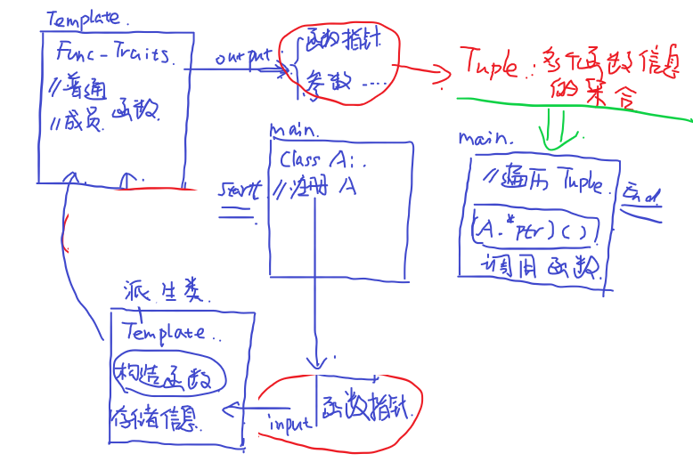

# 反射

让程序看到自己的数据，并且能够对数据进行操作

# 类型萃取

对类型做萃取，有一组混合类型，将特定类型获取出来
核心思路：使用模板来匹配查找

## 例子：指针类型萃取

解除一层指针，三级变二级，二级变一级

```c++
template <typename T>
struct remove_pointer {};

template <typename T>
struct remove_pointer<T*> {
  using type = T;
};

int main()
{
  using type = remove_pointer<int*>::type; //type 类型为int
  return 0;
}
```

## 固定流程

1. 声明一个标准的模板用来声明功能

```c++
template <typename T>
struct remove_const{};
```

2. 声明定义需要萃取的类，比如获取const修饰的类型

```c++
template <typename T>
//匹配参数，需要使用T来拼凑
struct remove_const<const T>{
  using type = T;
};
```

3. 使用时需要使用相应的传入参数，然后调用remove_const就可以获得T

```c++
int main()
{
  const int a;
  using type = remove_const<a>::type;
}
```

## 成员函数和普通函数的模型

对于一个普通函数int func(double) 其函数指针可以表示为int*(double)
而对于一个成员函数 int ClassA::func(double) 其函数指针为int (ClassA::*)(double)
对于一个成员变量 int ClassA::c 其指针为 int (ClassA::*) **可以直接使用cout输出为1，导致如果是两个不同的类如果使用两个指针来接受成员变量，然后做判断会出现true**

# 静态反射

eg.获取一个类中的成员函数信息然后，通过这些信息来调用它
广泛使用模板来获取信息，通过类型萃取将信息保存在一个tuple中，然后通过遍历tuple来调用对应的函数

主要流程为，首先建立函数类型萃取的类型萃取模板，通过传入的模板参数获取到函数的相关信息(函数指针，形参列表等)存入到tuple中，tuple的一个元素表示一个成员函数的信息。
之后可以遍历tuple列表来实现函数的调用



## 如何去注册一个类信息

注册一个类信息其实就是对类的成员函数与成员变量进行类型萃取，然后存入到一个tuple中，同样需要用到模板，主要是区别类
```c++
template <typename T>
struct TypeInfo{
    /* data */
};
```
首先第一种方法是利用纯模板构建
```c++
//对类的静态反射
//field_traits就是一个类型萃取器，用于获得传入的指针变量的信息
template <>
struct TypeInfo<Person>
{
    //获取类中的成员函数和成员变量信息
     static constexpr auto function = std::make_tuple(
        field_traits(&Person::IntroduceMyself),
        field_traits(&Person::IsFemale),
        field_traits(&Person::GetMarried)
     );
     static constexpr auto variables = std::make_tuple(
        field_traits(&Person::familyName),
        field_traits(&Person::height),
         field_traits(&Person::isFemale)
     );
};
```
第二种方式就是利用宏定义来实现
```c++
//使用宏定义 替代上面的模板
#define BEGIN_CLASS(X) template<> struct TypeInfo<X>{

//不定参数个数，##添加保护
#define functions(...) static constexpr auto functions = std::make_tuple(__VA_ARGS__);
//参数 #F获取F的字符串格式
#define func(F) field_traits(F,#F)

//成员变量
#define variables(...) static constexpr auto variables = std::make_tuple(__VA_ARGS__);
#define var(v) field_traits(v,#v)

#define END_CLASS()};
```
实际的使用就是
```c++
//注册
BEGIN_CLASS(Person)
    functions(
        func(&Person::IntroduceMyself),
        func(&Person::IsFemale),
        func(&Person::GetMarried)
    );
    variables(
        var(&Person::familyName),
        var(&Person::height),
        var(&Person::isFemale)
    )
END_CLASS()
```

## 如何调用一个类的函数指针指向的函数

```c++
Person p;
auto ptr = &Person::Func1;
(p.*ptr)();

Person* p
auto ptr = &Person::Func1;
(p->*ptr)();
```

## 静态反射的麻烦

需要考虑很多偏特化的东西，比如对于成员函数来说，其可能是const 或者 volatile等等，由于模板偏特化，所以我们为了萃取到所有信息，比如说类中有volatile修饰的函数，而我们没有添加就会报错，需要编写所有的模板参数。导致代码量增多。
然后对于类中成员变量和成员函数的区别，在教程中还是用了一个类模板来加以区分，并作为参数传入到派生类中以此来确定指针是为函数还是变量。
```c++
//判断是否为函数
//is_function_v 判断的是函数类型，而将要传入的T是一个函数指针，使用remove_pointer去除指针后判断
namespace detail
{
    template <typename T>
    struct is_function{
        static constexpr bool value = std::is_function_v<std::remove_pointer_t<T>> || std::is_member_function_pointer_v<T>;
    };
}

//通过传入指针类型T，可以判断T是函数指针还是变量指针
```